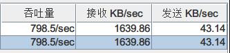

# 简单利用Spring Boot、Redis、RocketMQ、MySQL实现的单机秒杀系统

> 源代码：https://gitee.com/lengdanran/second-kill-system
>
> 只是利用一些技术，自己实现的秒杀系统，纯属个人尝试，还有很多的不足，可以实现在100W的请求访问下，商品不超卖
>
> **环境：**
>
> - RocketMQ（1核2G)云服务器
> - MySQL、Spring Boot、Redis等都在个人PC机上部署（Intel(R) Core(TM) i5-8265U CPU @ 1.60GHz）16G
>
> **测试：**
>
> - 利用程序随机生成10000个用户和100个书籍数据
> - 随机整合成测试数据，即是10000个用户每个人都抢这100个书籍，总共的测试数据为100*10000=100w条
> - 利用JMeter进行压力测试
>
> **架构**：
>
> - SpringBoot + Redis缓存 + RocketMQ异步消息 + MySQL

## 测试结果

100w测试：

10000个线程，Ramp-Up=2，循环100次，总共向接口发送100w的下单请求，很明显响应时间太长了




10W测试：


平均的响应时间为：1-2s


到这里，可以发现请求响应的时间已经突破了10s，这个延时很长了，同时吞吐量也降到了200/second


可以看出，目前我的机器可以实现大概500/second的吞吐量，平均每个请求的响应时间为2-3s，勉强可以接收。哈哈哈哈。


这个方式的主要流程为：

请求到了服务里面后，先是进行一个简单的过滤，随机数筛选：

``` java
	Random random = new Random();
    int i = random.nextInt(10);
    if (i < 6) return CommonReturnType.create("来晚了，下次再来");
```

这个步骤是请求消减策略，可以抛弃很多的请求，降低服务器的压力（测试来看，效果不是很好，服务压力还是很大，一个可能的方式是在请求分发的时候采用这个类似的策略，这样实际到服务的请求不会很多，可以用Nginx）.

乐观锁，在商品的字段中添加了一个version号，每次更新数据的时候，先观察持有的version和现在的version是否匹配，如果不匹配，则不更新。


---------

